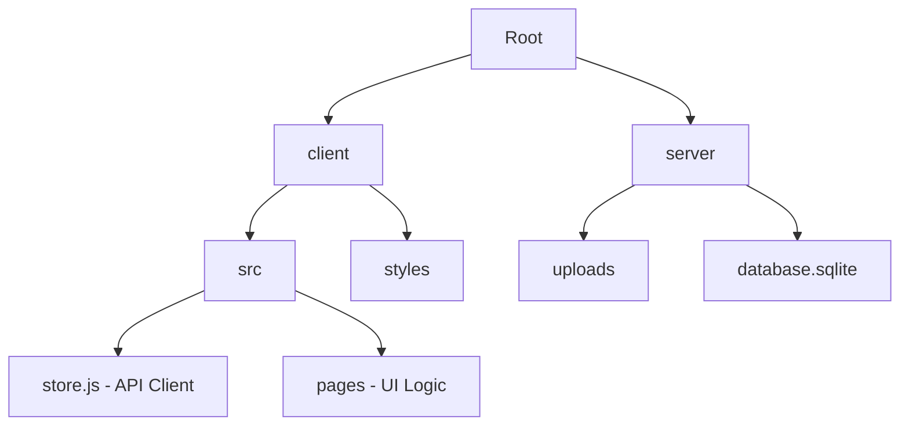

# 🚀 NoteVault — Premium Note Sharing Platform

NoteVault is a professional, community-driven platform for students to share, discover, and organize academic notes. Built with a stunning dark space theme, it features 3D card effects, glassmorphism, and a robust full-stack architecture.

---

## ✨ Features

- **🔐 Secure Authentication**: JWT-based login and signup with professional profile generation.
- **📚 Smart Organization**: Categorize notes by subject, class (UG/PG), and specific topics.
- **📎 PDF Support**: Upload study materials directly. Files are stored securely on the server.
- **🏅 Recognition System**: Earn community badges for sharing knowledge. Like and follow your favorite contributors.
- **🌪️ Premium UI/UX**: Ultra-smooth 3D tilt effects, floating animations, and responsive glassmorphic design.
- **🔍 Advanced Search**: Filter by subject, class, topic, or search by keywords.

---

## 🛠️ Tech Stack

### Frontend
- **Core**: Vanilla JavaScript (ES Modules)
- **Styling**: Vanilla CSS (Global variables, 3D transforms, Animations)
- **Build Tool**: Vite
- **Icons**: Lucide-inspired SVG system

### Backend
- **Server**: Node.js + Express
- **Database**: SQLite (via `better-sqlite3`)
- **Auth**: JSON Web Tokens (JWT) + BcryptJS
- **File Handling**: Multer

---

## 🚀 Getting Started

### Prerequisites
- Node.js (v16+)
- npm

### Installation

1. **Clone the repository**
   ```bash
   git clone https://github.com/yourusername/notevault.git
   cd notevault
   ```

2. **Install dependencies**
   ```bash
   npm run install-all
   ```

3. **Start the development server**
   ```bash
   npm run dev
   ```
   *This will start both the Express server (port 5000) and the Vite client (port 5173+) simultaneously.*

---

## 📂 Project Structure



---

## 🤝 Contributing

Contributions are welcome! Feel free to open an issue or submit a pull request.

## 📄 License

MIT License. See `LICENSE` for details.
